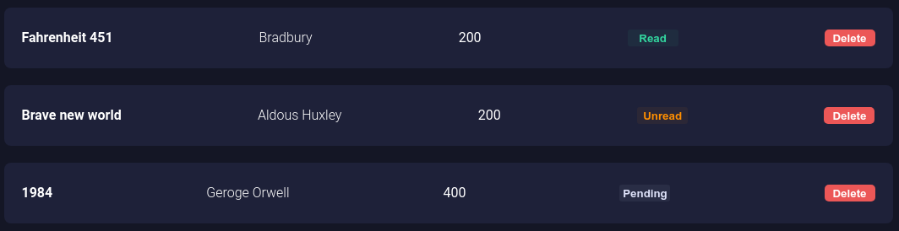
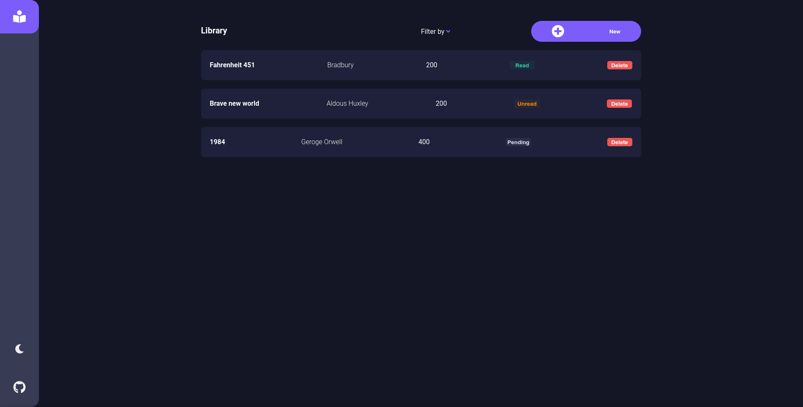
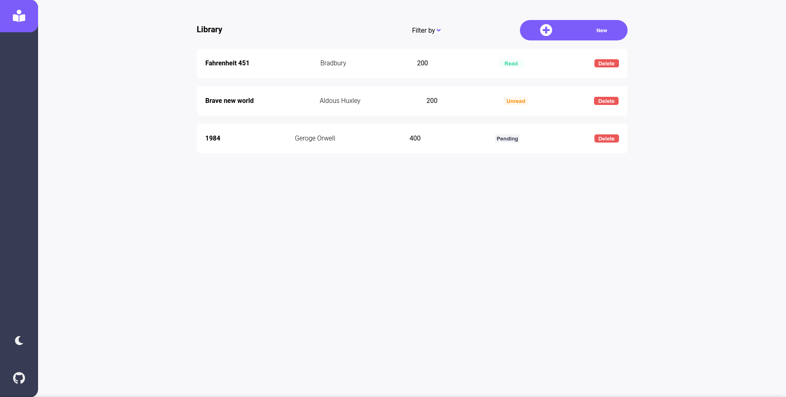

# Library app

This library app was made with the purpouse to track your books.

# Motivation

The idea of this project came from [The Odin Project] (https://www.theodinproject.com/)

Things I learn while I was doing this project:

```
I learn a lot about **Objects and object constructors**
I learn about how **prototypes** works.
I learn abut **mobile-first approach** to make my library responsive.
And much more.
```

# Features

1. In this library, you can have 3 main status.

You can have books as a `Read`, `Unread` and `Pending`



2. You have to main mode

- Dark mode
  

- Normal mode
  

# Credits

Made with love by me (and too much effort).
